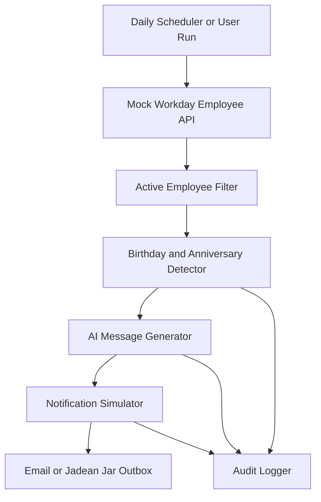

# Architecture

## Use Case

AI Employee Birthday & Work Anniversary Celebration Agent

## High-Level Flow

## Components

| Component | Responsibility |
|---|---|
| MockWorkdayClient | Loads employee profile, status, timezone, birth date, and hire date from mock Workday JSON |
| CelebrationDetector | Checks active employees and detects birthdays or work anniversaries by local date |
| CelebrationMessageGenerator | Generates personalized celebration messages using mock logic or an OpenAI-compatible LLM |
| NotificationService | Simulates Email or Jadean Jar notification delivery |
| AuditLogger | Records traceable JSONL audit logs for each run |
| Streamlit App | Provides a simple demo interface for running the agent |

## MVP Assumptions

- Workday is simulated using `data/mock_workday_employees.json`.
- Notifications are simulated and written to `outbox/notifications.jsonl`.
- LLM generation defaults to mock mode so the project runs without credentials.
- Real Workday APIs and real email/Jadean Jar APIs can replace the mock services later.

## Future Enhancements

- Replace mock JSON with Workday RaaS, REST, or SOAP API integration.
- Add real SMTP or Microsoft Graph email delivery.
- Add Jadean Jar API integration when available.
- Add scheduler support through cron, Windows Task Scheduler, or GitHub Actions.
- Add approval workflow for HR review before posting public messages.
